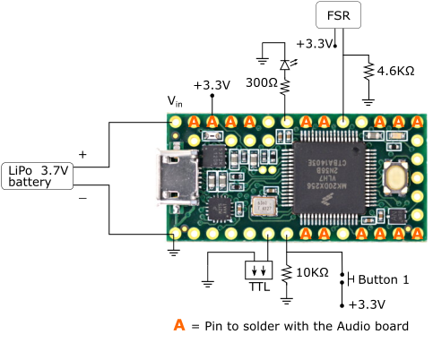
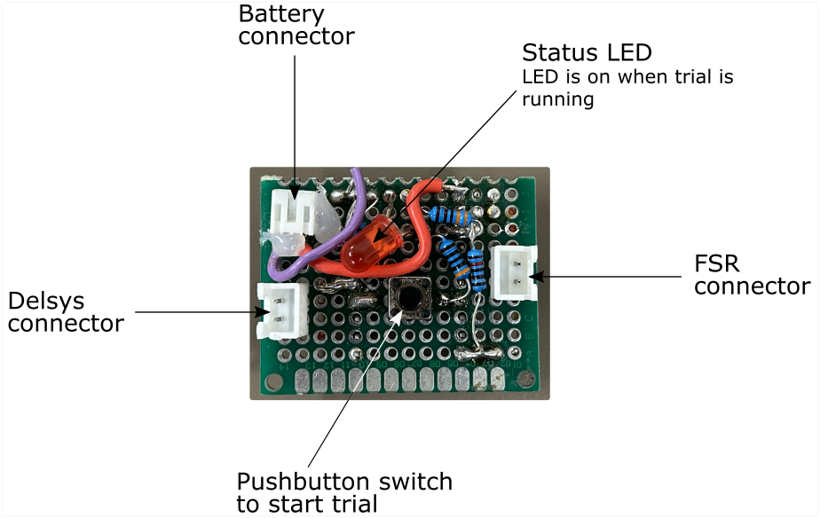
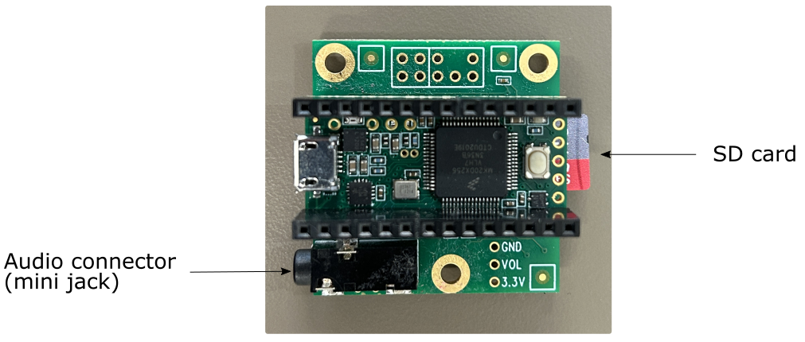
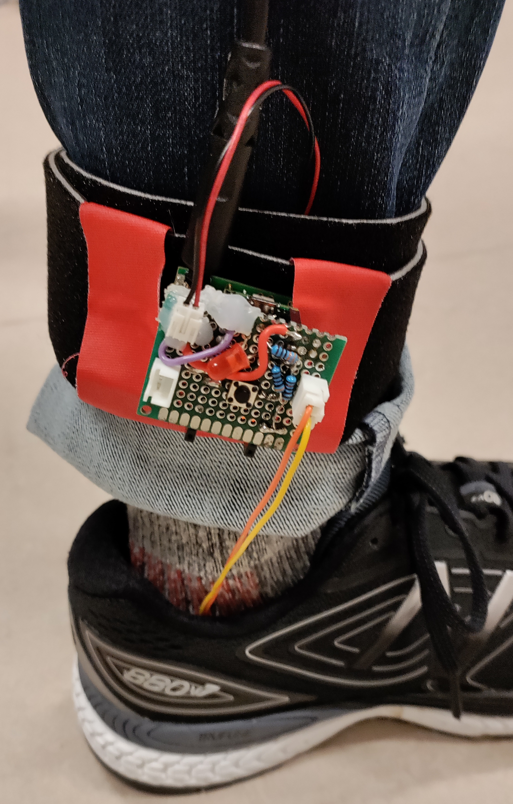

# Teensy Step

A framework for implementing sensorimotor synchronisation experiments. The framework is based on Teensy 3.2 and the Audio Adaptor Board for Teensy 3.x. The code reported here will allow the Teensy to record the onset of steps and deliver metronome click sounds over heaphones adapted to the initial cadence of the steps. Data is saved on the onboard SD Card for offline analysis. 

## Requirements

### Hardware
* [Teensy 3.2](https://www.pjrc.com/store/teensy32.html) 
* [Audio Adaptor](https://www.pjrc.com/store/teensy3_audio.html) for Teensy 3.2
* See the section [Building the circuit](#building-the-circuit) for detailed information

### Development software
The following software is required for uploading the code to Teensy.

* [Arduino IDE](https://www.arduino.cc/en/Main/Software). Code developed with Arduino 1.8.13.
* [Teensyduino extension for Arduino IDE](https://www.pjrc.com/teensy/teensyduino.html). Code developed using Teensyduino 1.53.

### Circuit schematic
Circuit diagram included here.

. 

### Installation (needs to be done only once)

1. Download the [Arduino IDE](https://www.arduino.cc/en/Main/Software) - (Teensyduino only works with some specific versions of Arduino IDE).

2. Download [Teensyduino](https://www.pjrc.com/teensy/td_download.html) and run the installer, pointing it to where you have installed the Arduino code. 

3. Download or clone this repository (i.e. `git clone https://github.com/dallabella-lab/teensystep`).

## Close-ups

---

## Usage

Once the prototype has been manufactured it can be attached to the participant's ankle to record their steps as shown in the picture below. The device should be tight enough to prevent movement during walking, but not too tight to cause discomfort or restrict the participant's movement.

## Sampling frequency

The sampling frequency of Teensystep is 1KHz.

## References

The code for this project started as a modification of TeensyTap by Floris van Vugt, Sept 2019 [https://github.com/florisvanvugt/teensytap](https://github.com/florisvanvugt/teensytap)

